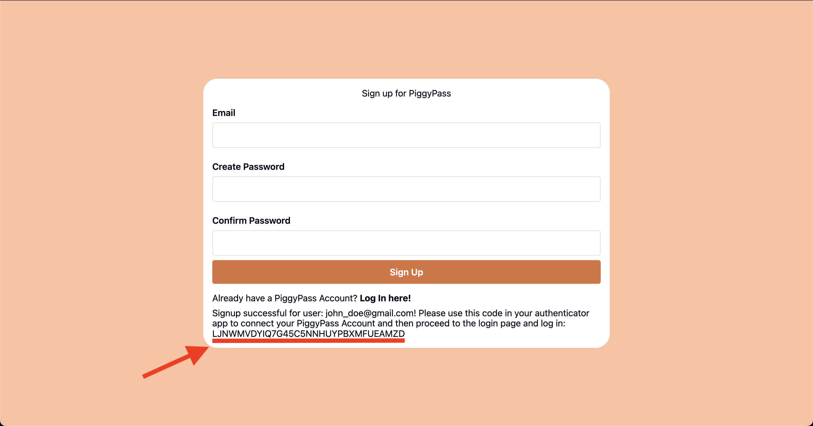
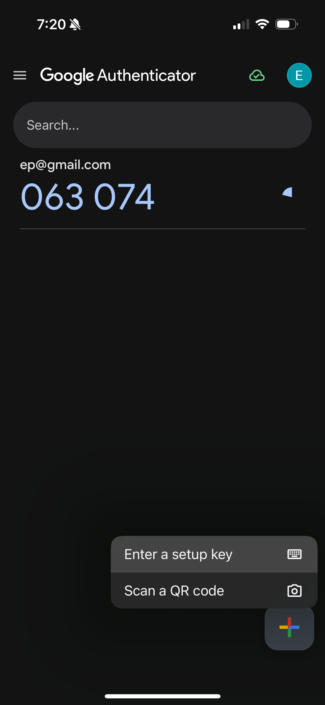
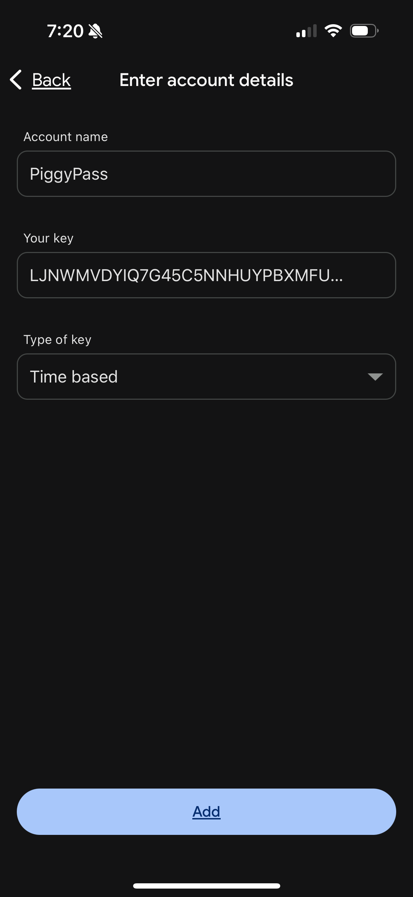
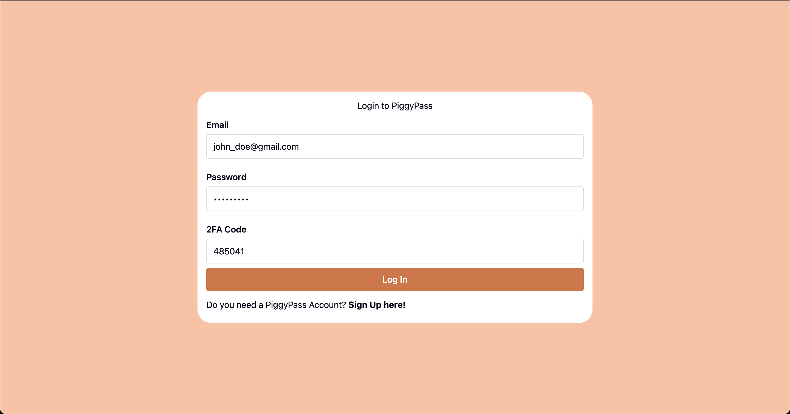

# Create an Account

Welcome to PiggyPass! Please use these instructions to create an account and set up your timed OTP (TOTP).
1. Go to the sign up page.
2. Input your email, and password. Please make sure that your password follows these requirements:
    1. Must have at least 2 uppercase letters.
    2. Must have at least 3 lowercase letters.
    3. Must include one symbol.
    4. Must have at least 2 digits.
3. Once you confirm your password and press ```Sign Up``` you will see something like the photo below inclusing your TOTP key. Please record this key as there is NO WAY to get it again. <br />

4. Congrats! You have made a PiggyPass account. Once you set up your TOTP you can log in. 

## Set Up your TOTP
1. Download your favorite authenticator app on your phone. We recommend Google Authenticator which we will show in our instructions.
2. On the bottom right add a key by pressing the plus icon and then ```Enter a setup key``` <br />

3. Enter your desired account name and copy the TOTP key given to you in the sign up page. Ensure that the type of key is time based, then add. <br />

4. You should now see a 6 digit code that refreshes every 30 seconds. Use this to log in to your account.

# Login to PiggyPass
1. Enter your email and password that you created.
2. Go to your authenticator app and enter your current TOTP code. 
3. Quickly quick log in as the TOTP code is only valid every 30 seconds.

4. Congratulations you have successfully logged into PiggyPass!